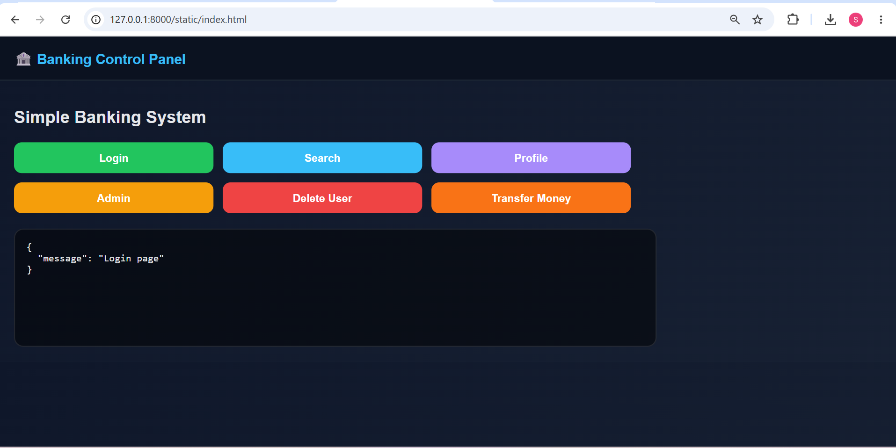
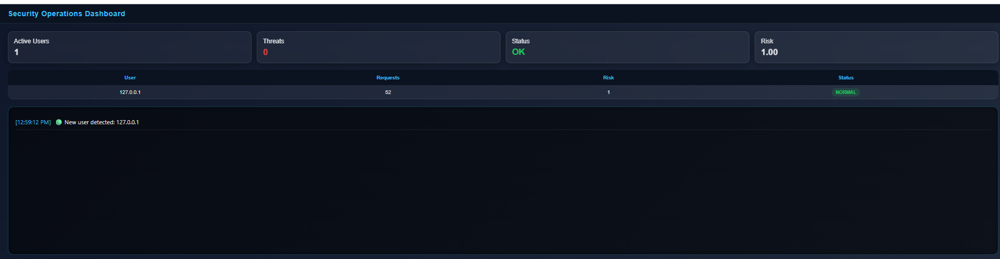
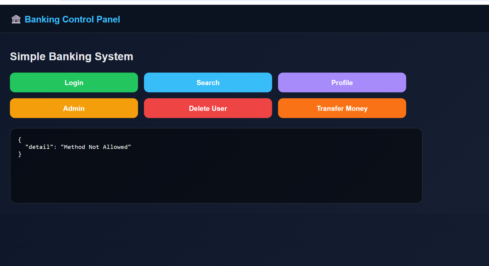
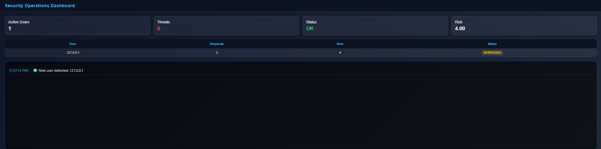
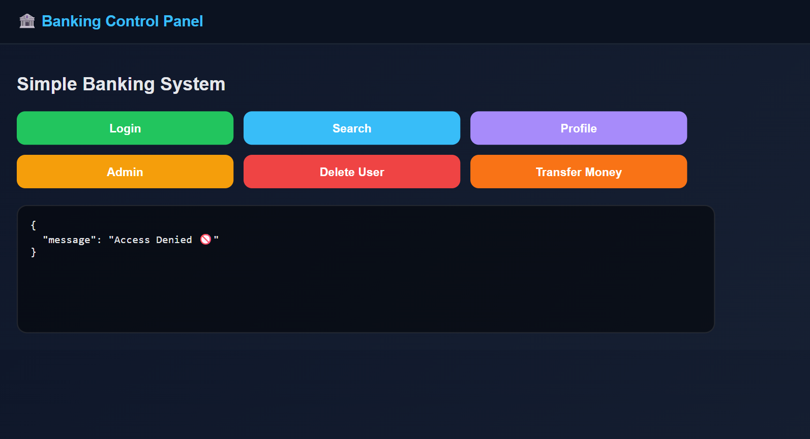
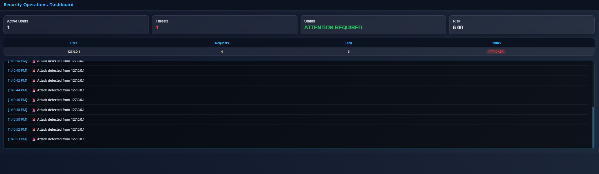
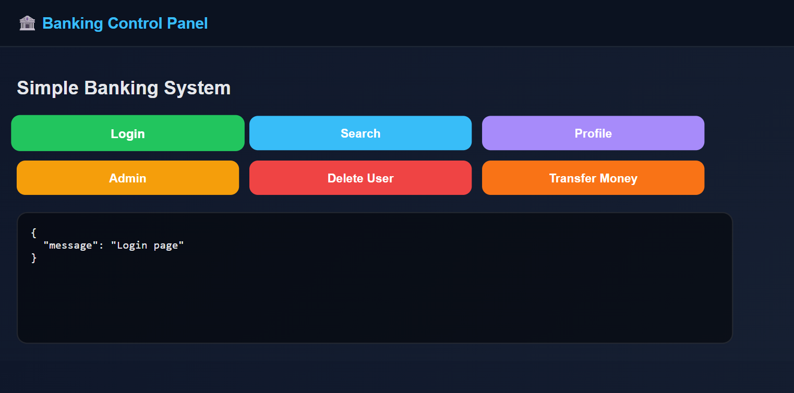
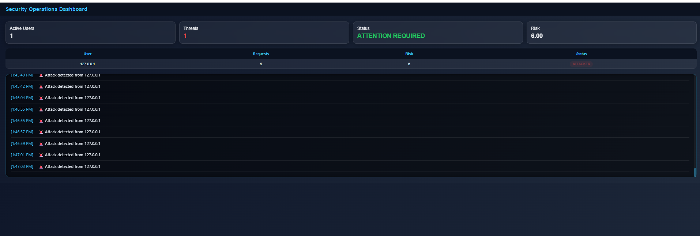

# Validation Results

**Validation Date:** July 2026

**Environment**

- Operating System: Windows 11
- Framework: FastAPI
- Language: Python 3.14
- Browser: Google Chrome

---

# TC-01 – Normal User Behaviour

## Objective

Validate that legitimate user activity is processed normally without triggering adaptive security controls.

---

## Test Steps

1. Launch the Banking Control Panel.
2. Launch the Security Operations Dashboard.
3. Perform normal application usage by repeatedly accessing:
   - Login
   - Search
   - Profile
4. Observe the dashboard metrics after multiple requests.

---

## Expected Result

- User is classified as **NORMAL**.
- Risk score remains low.
- No threats are detected.
- Request counter increases correctly.
- Dashboard updates in real time.

---

## Actual Result

The framework successfully processed **52 API requests** generated through normal application usage.

Observed dashboard metrics:

- **Active Users:** 1
- **Threats Detected:** 0
- **System Status:** OK
- **Average Risk Score:** 1.00
- **User Classification:** NORMAL

The adaptive security engine correctly recognised legitimate user behaviour without applying any defensive restrictions.

---

## Evidence

### Banking Panel



### Dashboard



---

## Result

✅ **PASS**

---

# TC-02 – Suspicious Behaviour Detection

## Objective

Validate that the adaptive risk engine identifies suspicious user behaviour before escalating the session to an attacker.

---

## Test Steps

1. Launch the Banking Control Panel.
2. Launch the Security Operations Dashboard.
3. Perform a controlled sequence of requests to privileged administrative endpoints.
4. Observe the cumulative risk score and user classification.

---

## Expected Result

- User is classified as **SUSPICIOUS**.
- Risk score exceeds the suspicious threshold.
- Dashboard updates automatically.
- Adaptive security response is initiated.

---

## Actual Result

The adaptive risk engine successfully identified abnormal access patterns after **3 API requests**.

Observed dashboard metrics:

- **Active Users:** 1
- **Threats Detected:** 0
- **System Status:** OK
- **Processed Requests:** 3
- **Risk Score:** 4
- **User Classification:** SUSPICIOUS

The framework correctly classified the session as **SUSPICIOUS**, demonstrating behavioural analysis before attacker escalation.

---

## Evidence

### Banking Panel



### Dashboard



---

## Result

✅ PASS

---

# TC-03 – Attacker Detection & Adaptive Response

## Objective

Validate that the framework detects malicious behaviour, classifies the session as an attacker, and continuously monitors ongoing attacks.

---

## Test Steps

1. Launch the Banking Control Panel.
2. Launch the Security Operations Dashboard.
3. Generate malicious activity by repeatedly accessing:
   - Admin Dashboard
   - Delete User
   - Transfer Money
4. Continue until the attacker threshold is exceeded.
5. Observe dashboard updates and attack logs.

---

## Expected Result

- User is classified as **ATTACKER**.
- Threat counter increases.
- Dashboard status changes to **ATTENTION REQUIRED**.
- Real-time attack alerts are generated.
- Adaptive security controls are activated.

---

## Actual Result

The adaptive risk engine successfully detected repeated malicious requests and escalated the session to **ATTACKER**.

### Observed Dashboard Metrics

| Metric | Value |
|--------|------:|
| Active Users | 1 |
| Threats Detected | 1 |
| System Status | ATTENTION REQUIRED |
| Processed Requests | 4 |
| Risk Score | 6 |
| User Classification | ATTACKER |

The dashboard continuously generated attack alerts while monitoring the attacker session, demonstrating continuous behavioural analysis and adaptive threat detection.

---

## Evidence

### Banking Panel



### Dashboard



The dashboard continuously generated alerts similar to:

```
🚨 Attack detected from 127.0.0.1
```

confirming continuous monitoring of malicious activity.

---

## Result

✅ PASS

---

# TC-04 – Critical Endpoint Protection

## Objective

Validate that the framework protects critical application endpoints by denying access after malicious behaviour is detected.

---

## Test Steps

1. Launch the Banking Control Panel.
2. Launch the Security Operations Dashboard.
3. Generate malicious activity until the user is classified as **ATTACKER**.
4. Attempt to access:
   - Admin Dashboard
   - Delete User
   - Transfer Money
5. Observe the API response.

---

## Expected Result

- User is classified as **ATTACKER**.
- Adaptive security controls are activated.
- Requests to critical endpoints are blocked.
- HTTP 403 **Access Denied** response is returned.

---

## Actual Result

After the adaptive risk engine classified the session as **ATTACKER**, subsequent requests to protected endpoints were automatically denied.

The framework successfully prevented access to sensitive resources by returning an HTTP 403 response, demonstrating adaptive protection of critical application assets.

### API Response

```json
{
  "message": "Access Denied 🚫"
}
```

---

## Evidence

### Banking Panel


### Dashboard


---

## Result

✅ PASS

---

# TC-05 – Real-Time Security Dashboard Monitoring

## Objective

Validate that the Security Operations Dashboard continuously reflects user activity, cumulative risk scores, threat status, and security events in real time.

---

## Test Steps

1. Launch the Security Operations Dashboard.
2. Perform user actions using the Banking Control Panel.
3. Observe dashboard updates without refreshing the page.

---

## Expected Result

- Active user count updates automatically.
- Request count increases.
- Risk score changes dynamically.
- User classification transitions from **NORMAL → SUSPICIOUS → ATTACKER**.
- Threat counter updates immediately.
- Live security events are displayed.

---

## Actual Result

The dashboard continuously monitored application activity and updated all security metrics automatically.

During validation, the dashboard successfully displayed:

- Active user count
- Processed request count
- Dynamic cumulative risk score
- User classification
- Threat count
- Live attack notifications
- Overall system security status

All dashboard components refreshed automatically without requiring manual page reloads.

---

## Evidence

### Banking Panel



### Dashboard



---

## Result

✅ PASS

---

# Validation Summary

| Test ID | Validation Scenario | Status |
|---------|----------------------|--------|
| TC-01 | Normal User Behaviour | ✅ PASS |
| TC-02 | Suspicious Behaviour Detection | ✅ PASS |
| TC-03 | Attacker Detection & Adaptive Response | ✅ PASS |
| TC-04 | Critical Endpoint Protection | ✅ PASS |
| TC-05 | Real-Time Security Dashboard Monitoring | ✅ PASS |

---

# Overall Validation Result

All five validation scenarios were executed successfully. The Evolution-Aware Adaptive Cyber Defense framework demonstrated:

- Legitimate user recognition
- Progressive behavioural risk analysis
- Suspicious activity detection
- Attacker classification
- Critical endpoint protection
- Automatic access restriction (HTTP 403)
- Real-time security dashboard monitoring

**Overall Project Status:** : **VALIDATED**
